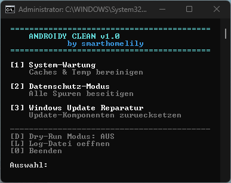
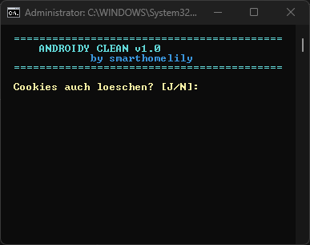
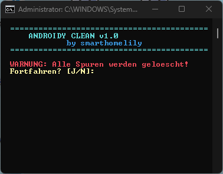

# Androidy Clean v1.0

<p align="center">
  
</p>

<p align="center">
  <strong>Windows Cleaning & Privacy Tool</strong><br>
  <em>Dein System. Deine Daten. Deine Kontrolle.</em>
</p>

<p align="center">
  <a href="#features">Features</a> •
  <a href="#installation">Installation</a> •
  <a href="#verwendung">Verwendung</a> •
  <a href="#lizenz">Lizenz</a>
</p>

---

## Features

### 🧹 System-Wartung
- **Browser-Caches** — Chrome, Firefox, Edge, Brave, Opera, Vivaldi
- **Temp-Ordner** — User & System Temp bereinigen
- **Prefetch** — Windows Prefetch leeren
- **Papierkorb** — Alle Laufwerke
- **Datenträgerbereinigung** — Mit Auswahl-Dialog oder Schnellmodus

### 🔒 Datenschutz-Modus
Alles aus System-Wartung, plus:
- **Browser-Cookies & Verlauf** — Vollständig löschen
- **Recent Files** — Zuletzt verwendet, Jump Lists
- **Explorer-Verlauf** — Adressleiste, Ausführen-Dialog
- **Office Recent** — Zuletzt geöffnete Dokumente
- **Event-Logs** — Windows Ereignisanzeige
- **DNS-Cache** — Aufgelöste Domains
- **Zwischenablage** — Clipboard leeren
- **Schattenkopien** — Optional: Wiederherstellungspunkte

### 🔧 Windows Update Reparatur
- Stoppt Update-Dienste
- Setzt SoftwareDistribution & catroot2 zurück
- Startet Dienste neu

### ⚡ Extras
- **Dry-Run Modus** — Vorschau ohne echte Löschung
- **Log-Datei** — Protokollierung aller Aktionen
- **Windows 10 & 11** — Volle Kompatibilität

## Screenshots

| Hauptmenü | System-Wartung | Datenschutz |
|:---------:|:--------------:|:-----------:|
|  |  |  |

## Voraussetzungen

- Windows 10 oder 11
- PowerShell 5.1 (vorinstalliert)
- **Administrator-Rechte** (für volle Funktionalität)

## Installation

### Option A: Download

1. [Release herunterladen](../../releases/latest)
2. ZIP entpacken
3. `Androidy-Clean-v1.0.bat` ausführen

### Option B: Git Clone

```powershell
git clone https://github.com/smarthomelily/Androidy-Clean.git
cd Androidy-Clean
.\Androidy-Clean-v1.0.bat
```

### Desktop-Verknüpfung erstellen

```powershell
.\Androidy-Clean-v1.0-Verknuepfung.bat
```

> **Tipp:** Rechtsklick auf Verknüpfung → Eigenschaften → Erweitert → "Als Administrator ausführen"

## Verwendung

### System-Wartung (Menüpunkt 1)

Für regelmäßige Reinigung ohne Login-Verlust:

1. Cookies löschen? `J` oder `N`
2. Schattenkopien löschen? `J` oder `N`
3. Datenträgerbereinigung: `A` (Auswahl) oder `S` (Schnell)

### Datenschutz-Modus (Menüpunkt 2)

Für maximale Spurenbeseitigung:

1. Bestätigung mit `J`
2. Schattenkopien löschen? `J` oder `N`
3. Datenträgerbereinigung: `A` oder `S`

> ⚠️ **Achtung:** Löscht alle Browser-Logins, Verlauf und Windows-Aktivitäten!

### Windows Update Reparatur (Menüpunkt 3)

Bei Update-Problemen:

1. Bestätigung mit `J`
2. Nach Abschluss: PC neu starten
3. Windows Update erneut versuchen

### Dry-Run Modus

Mit `D` im Hauptmenü aktivieren. Zeigt was gelöscht würde, ohne tatsächlich zu löschen.

## Dateistruktur

```
Androidy-Clean/
├── Androidy-Clean-v1.0.ps1           # Hauptskript
├── Androidy-Clean-v1.0.bat           # Starter (Admin-Rechte)
├── Androidy-Clean-v1.0-Verknuepfung.ps1
├── Androidy-Clean-v1.0-Verknuepfung.bat
├── Androidy-Clean-v1.0.ico           # Icon
├── Androidy-Clean-v1.0.png           # Logo
└── Androidy-Clean.log                # Log (wird erstellt)
```

## Teil der Androidy-Familie

| Tool | Beschreibung |
| :--- | :--- |
| [Androidy Clean](https://github.com/smarthomelily/Androidy-Clean) | Windows Cleaning & Privacy Tool |
| [Androidy Install](https://github.com/smarthomelily/Androidy-Install) | WinGet Installer |
| [Androidy Update](https://github.com/smarthomelily/Androidy-Update) | Windows Update Tool |
| **Androidy Umzug** | PC-Migration & Datensicherung (coming soon) |

## FAQ

**Q: Werden meine Browser-Passwörter gelöscht?**  
A: Nein. Nur Caches, Cookies und Verlauf. Gespeicherte Passwörter bleiben erhalten.

**Q: Kann ich gelöschte Daten wiederherstellen?**  
A: Nein. Die Löschung ist endgültig. Nutze den Dry-Run Modus zur Vorschau.

**Q: Warum braucht das Tool Admin-Rechte?**  
A: Für System-Temp, Prefetch, Event-Logs und Windows Update Reset.

## Lizenz

Dieses Projekt steht unter der **GNU General Public License v3.0**.

Siehe [LICENSE](LICENSE) für Details.

```
Copyright (c) 2026 smarthomelily

Dieses Programm ist freie Software. Du kannst es weitergeben und/oder
modifizieren unter den Bedingungen der GNU General Public License v3.
```

## Beitragen

Bugs gefunden? Feature-Wünsche?

1. [Issue erstellen](../../issues/new)
2. Fork → Branch → Pull Request

Siehe [CONTRIBUTING.md](CONTRIBUTING.md) für Details.

---

<p align="center">
  Made with ❤️ by <a href="https://github.com/smarthomelily">smarthomelily</a>
</p>
